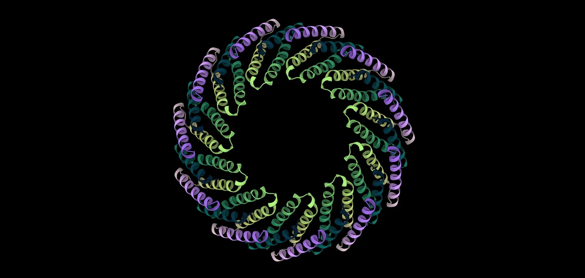

  

### Hi, I'm Jose

I design proteins and like writing software. 

For the protein part: my current focus is high-order symmetric oligomer design.

For the software: I'm currently building [**prosapia**](https://github.com/jlmoraleshellin/prosapia), a shared, dynamic workbench for protein-design tools on HPC. What started as a personal tool to streamline my own design workflows, has now become a general workbench others can build on. Check it out!
